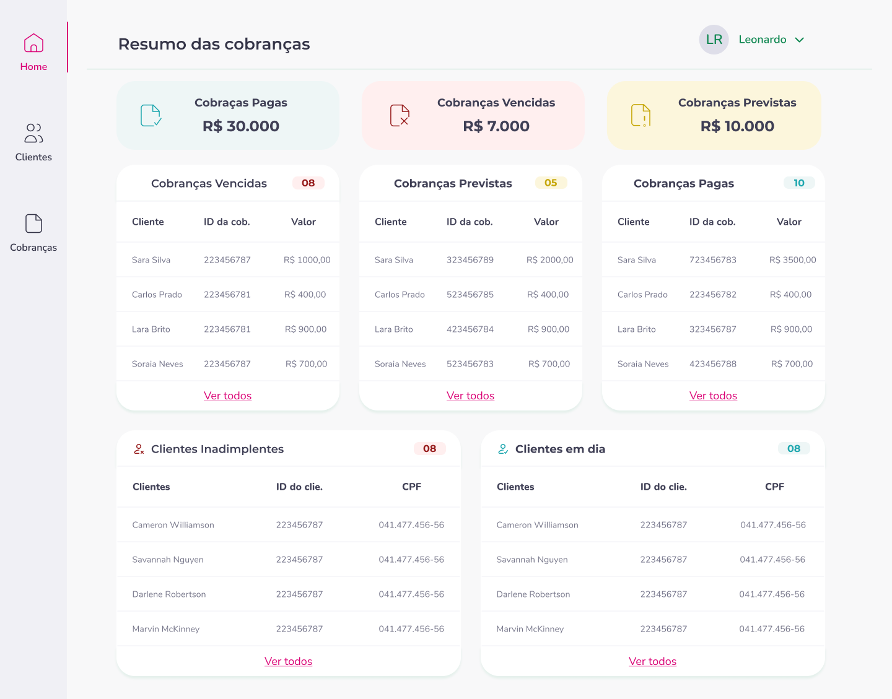

<h1 align="center"> Aplicativo de Controle Financeiro CDB - UI</h1>

<p align="center">
Aplicativo de controle financeiro para uma empresa, contando com uma página de resumo geral, uma página de registro e controle de clientes e uma página de registro e controle de cobranças.
</p>

<p align="center">
  <a href="#-tecnologias">Tecnologias</a>&nbsp;&nbsp;&nbsp;|&nbsp;&nbsp;&nbsp;
  <a href="#-projeto">Projeto</a>&nbsp;&nbsp;&nbsp;|&nbsp;&nbsp;&nbsp;
  <a href="#-layout">Layout</a>&nbsp;&nbsp;&nbsp;
</p>

<br>

<p align="center">
  
</p>

## 🚀 Tecnologias

Esse projeto foi desenvolvido com as seguintes tecnologias:

- ReactJS
- MaterialUI
- HTML e CSS
- JavaScript
- Postgres(SQL)
- Token de autenticação
- Git e Github
- Deploy

## 💻 Projeto

O sistema trata-se de uma aplicação para controle financeiro para uma empresa, contando com três páginas, sendo elas: ```Home```, ```Clientes``` e ```Cobranças```.

Na página ```Home``` é possível visualizar um quadro de resumo geral com tabelas de cobranças vencidas, cobranças previstas e cobranças pagas, clientes inadimplentes e clientes em dia, além do valor total das cobranças vencidas, cobranças previstas e cobranças pagas.

Já na página de ```Clientes``` é possível visualizar uma tabela geral dos clientes da empresa, assim como, acessar as informações detalhadas de cada cliente e suas respectivas cobranças. Sendo possível também fazer a buscar de um cliente específico através do seu Nome, CPF ou E-mail. 

Por fim, na página de ```Cobranças``` é possível visualizar uma tabela geral das cobranças da empresa, assim como, acessar as informações detalhadas de cada cobrança e também excluir uma cobrança, caso seja necessário(Só poderão ser excluídas as cobranças pendentes). Sendo possível também fazer a buscar de uma cobrança específica através do nome do cliente ou ID da cobrança.

Nesta aplicação consta as seguintes funcionalidades são:

- Cadastrar Usuário
- Fazer Login 
- Detalhar Perfil do Usuário Logado 
- Editar Perfil do Usuário Logado 
- Cadastrar cliente
- Listar clientes
- Detalhar informações do cliente
- Atualizar informações do cliente
- Buscar cliente pelo nome do cliente, CPF ou E-mail
- Cadastrar cobrança
- Listar cobranças
- Detalhar cobrança
- Atualizar cobrança
- Deletar cobrança
- Buscar cobrança pelo nome do cliente ou ID da cobrança

## 🔖 Layout

Você pode visualizar o layout do projeto através [DESSE LINK](https://www.figma.com/file/7EwgLSgJGgsYQoiA6IxC4j/Aplicativo-de-Controle-Financeiro-CDB?type=design&t=9suxxqMOuAEEeJMA-1). É necessário ter conta no [Figma](https://figma.com) para acessá-lo.